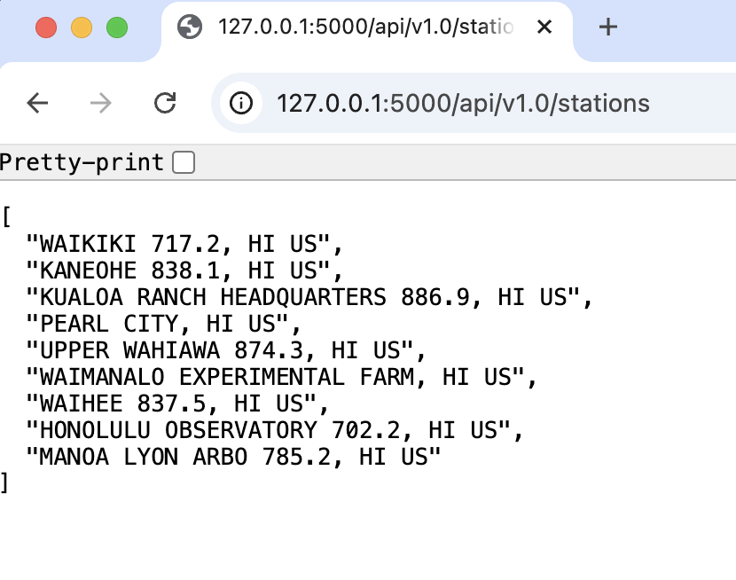
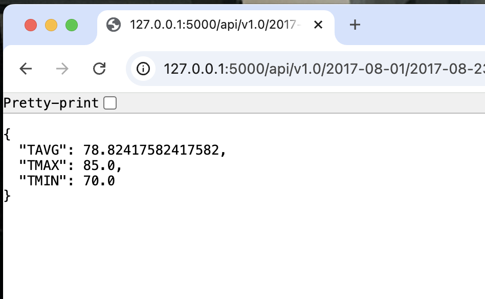

# sqlalchemy-challenge
Module 10 Challenge

For this challenge, I first used SQLAlchemy ORM queries, Pandas, and Matplotlib to analyze the data provided in the hawaii.sqlite file. I then created an app so users could run their own queries from the data. 

For the queries in pandas I explored the precipitation for the previous 12 months and plotted it in a bar chart shown below (all of the code for the queries and matplotlib is in the climate_analyze.ipynb file): 

I then ran the summary statistics for the precipitation data to get the follow results: 

I then started to exposure the station data provided in the hawaii.sqlite file. First I ran a query to see which stations were the most active by counting how many measurements there were for each station, then sorting them in descending order to see which station was the most active. The following are the results:

I then created and ran a query to get the minimum, maximum, and average temperature for the most active station (Station USC00519281). These are the results:

[(54.0, 85.0, 71.66378066378067)]

Then for the most active station (Station USC00519281), I ran a query to create a histogram for the temperature data for the previous 12 months. These are the results:

Once my queries were created, I created the code that would run the app. The code for the app can be found in the app.py file. 

The home page for the app has five options for queries that can be run. Here is a screenshot of the home page:

The first query that can be run, /api/v1.0/precipitation, is the precipitation analysis for the previous year. Here is a screenshot of the results:

The second query, /api/v1.0/stations, provides a list of all of  the stations. Here is a screenshot:

The third query, /api/v1.0/tobs, returns a list of the temperature observations for the most active station for the previous year. Here is a screenshot:

The fourth query, /api/v1.0/<start>, returns the minimum, average, and maximum temperature for whatever date is specified as the start date. Here is the results of the query when the start date entered is 2016-08-23:

The last query, /api/v1.0/<start>/<end>, provides the minimum, average, and maximum temperature for whatever date range is specified. Here are the results for the query when the start date is 2017-08-01 and the end date is 2017-08-23:

